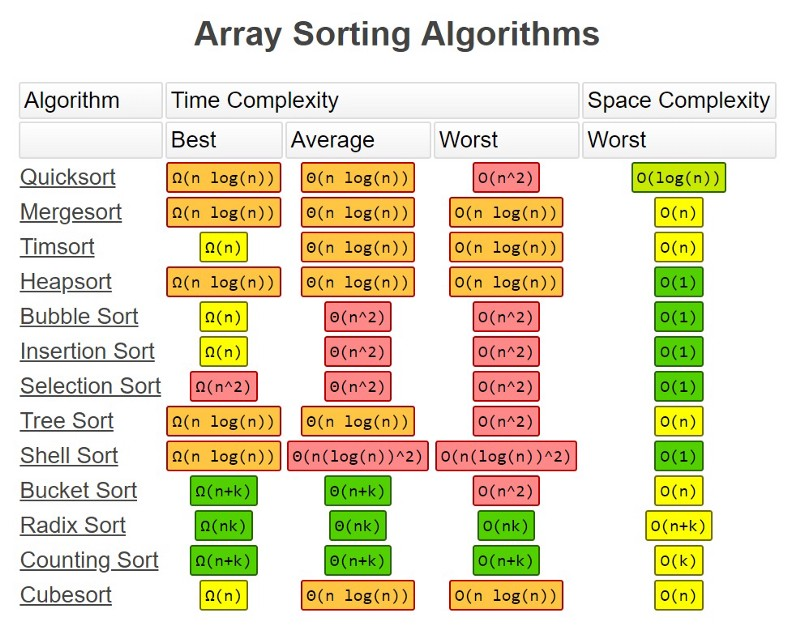

# Data Structures and Algorithms in Python

Welcome to my repository dedicated to learning and implementing core **Data Structures and Algorithms (DSA)** using
Python.

This project is built as a study aid, interview preparation tool, and personal reference.

To check how the implementation works of each data structure, open a Custom(Structure).py to view the code.

---

## Big O Notation

Big O Notation is a way to describe the **performance** or **complexity** of an algorithm. It expresses how the runtime
or space requirements of an algorithm grow relative to the input size. Big O helps us understand which algorithm is more
efficient as inputs become large.

Common complexities include:

- **O(1)** – Constant time
- **O(log n)** – Logarithmic time
- **O(n)** – Linear time
- **O(n log n)** – Linearithmic time
- **O(n²)** – Quadratic time
- **O(2ⁿ)** – Exponential time

Below are visual resources to help illustrate this concept:


---

## Project Structure

- Each data structure or algorithm is organized in its own directory.
- Where applicable, example usage and test files are included.
- All illustrations are located in the `images/` folder.

---

## Arrays

Collections of elements in contiguous memory allowing fast access by index.
Commonly used in numerical computations, static datasets, as building blocks for other data structures, and as buffers
in I/O
operations.

### Types:

- **Static Arrays** - fixed size, memory allocated at compile time (or creation). Fast access, memory-efficient, but
  cannot grow beyond initial size.
- **Dynamic Arrays** - can grow or shrink during runtime (e.g., Python lists, Java ArrayList). More flexible but may
  require resizing, which can be costly.

### Concepts:

- Accessing elements by index is O(1).
- Insertion/deletion in the middle requires shifting elements → O(n).
- Dynamic arrays resize by allocating new memory and copying elements, usually doubling the size when capacity is
  exceeded.
- Can be used as a building block for more complex structures like stacks, queues, and heaps.

### Operations:

- Insertion and deletion
- Searching and sorting
- Rotation and reversal

**Tips/Pitfalls**

- Use static arrays when size is known and memory efficiency matters.
- Dynamic arrays are flexible but resizing can be expensive.
- Inserting or deleting in the middle is slower than at the ends.

---

## Hash Tables

Data structures storing key-value pairs using a hash function to map keys to positions.
Commonly used in caches, dictionaries, symbol tables, and fast lookup scenarios.

### Concepts

- Average lookup/insert/delete is O(1), but worst-case O(n) if collisions are poorly handled.
- Good hash function is critical for performance.
- Can handle collisions via separate chaining or open addressing.

### Operations

- Insertion and deletion
- Key lookup
- Collision handling

**Tips/Pitfalls**

- Choosing a poor hash function can degrade performance.
- Use for fast lookup and when key-value mapping is required.

---

## Linked Lists

Sequences of nodes where each node points to the next (and sometimes previous) node.
Commonly used in memory-efficient data storage, dynamic data structures, and implementing stacks/queues.

### Types

- **Singly Linked List** - each node points to the next.
- **Doubly Linked List** - nodes point to both next and previous nodes.

### Concepts

- Insertion/deletion at head or tail is O(1), searching is O(n).
- Extra memory needed for pointers compared to arrays.

### Operations

- Insertion and deletion
- Search
- Reversal.

**Tips/Pitfalls**

- Great for dynamic datasets where frequent insertion/deletion is needed.
- Not ideal for random access – use arrays for that.

---

## Stacks & Queues

Linear data structures for managing elements in a specific order.

### Concepts

- **Stacks**: LIFO (Last In, First Out). Used in recursion simulation, undo operations, and parsing.
- **Queues**: FIFO (First In, First Out). Used in task scheduling, BFS traversal, buffering data streams, and
  printer/job queues.

### Implementations:

- Python lists
- Linked lists
- Queues with Stacks

**Tips/Pitfalls**

- Stacks can cause overflow if too deep recursion.
- Queues are great for level-order traversal (BFS).

---

## Trees

Hierarchical structures where each node can have multiple children but only one parent.
Commonly used in file systems, databases (B-trees), binary search trees for fast lookup, and hierarchical data
representation.

### Implementations:

- Binary Trees
- Binary Search Trees (BST)

### More about trees:

#### Types of trees:

- **Balanced Trees**  
  A balanced tree maintains a roughly equal height between the left and right subtrees for each node. This ensures
  efficient operations such as insertion, deletion, and search, typically in O(log n) time.  
  Examples: AVL Trees, Red-Black Trees

- **Unbalanced Trees**  
  An unbalanced tree can have one side significantly deeper than the other. This degrades performance, potentially
  making operations as slow as O(n), especially when the tree resembles a linked list.

#### Tree Traversals

- **In-order**  
  Visits nodes in the following order: Left → Root → Right  
  (Useful for retrieving values in sorted order from a BST)

- **Pre-order**  
  Visits nodes in the following order: Root → Left → Right  
  (Useful for copying the tree or generating prefix expressions)

- **Post-order**  
  Visits nodes in the following order: Left → Right → Root  
  (Useful for deleting the tree or evaluating postfix expressions)

### Self-Balancing Trees

Self-balancing trees maintain their structure automatically after insertions or deletions to preserve optimal
performance.

- **AVL Trees**  
  AVL trees maintain a balance factor (height difference) of -1, 0, or 1 for each node. If a node becomes unbalanced,
  rotations are used to restore balance.

- **Red-Black Trees**  
  Red-Black trees use color properties and a set of rules to maintain balance. While slightly less rigid than AVL trees,
  they provide good performance for insertions and deletions in practice.

### Binary heaps

Binary Heaps are complete binary trees that satisfy the **heap property**:

- **Max-Heap**: Every parent node has a value **greater than or equal to** its children.
- **Min-Heap**: Every parent node has a value **less than or equal to** its children.

They are commonly implemented using arrays, taking advantage of the index relationships:

- For a node at index `i`:
    - Left child: `2i + 1`
    - Right child: `2i + 2`
    - Parent: `(i - 1) // 2`

### Operations

- **Insert**  
  Adds a new element to the heap and restores the heap property by "bubbling up" the value.

- **Extract Max / Min**  
  Removes the root element and restores the heap property by "bubbling down" the last element.

- **Heapify**  
  Converts an unordered array into a valid heap in O(n) time.

### Use Cases

- Priority Queues
- Heap Sort (O(n log n))
- Efficient retrieval of min/max elements

### Priority Queues

A **Priority Queue** is an abstract data structure where each element has a "priority". Elements are served based on
their priority rather than just their order in the queue.

#### Characteristics

- Elements with **higher priority** are dequeued before elements with lower priority.
- If two elements have the **same priority**, they are served in the order they were enqueued (FIFO).

#### Implementations

- **Binary Heaps** are the most efficient and commonly used way to implement priority queues.
    - Max-Heaps → for highest-priority first.
    - Min-Heaps → for lowest-priority first.

#### Operations

- **Insert / Enqueue**: Add an element with its priority.
- **Extract / Dequeue**: Remove the element with the highest (or lowest) priority.
- **Peek**: View the top-priority element without removing it.

#### Use Cases

- Task scheduling (e.g., CPU job queues)
- Dijkstra’s algorithm (for shortest paths)
- Event-driven simulations

### Trie

Trie (Prefix Tree)

A **Trie** is a tree-like data structure used to store a dynamic set of strings, where keys are usually strings. It is
especially efficient for string-related operations like prefix matching or autocomplete.

### Characteristics

- Each node represents a single character of a string.
- The root node is empty and paths from root to leaf represent words.
- Nodes may store:
    - A character (implicitly via position)
    - A flag indicating the end of a word (`is_end_of_word`)
    - Optionally, a count or value (e.g., frequency)

### Operations

- **Insert(word)**: Adds a word to the trie, creating new nodes as needed.
- **Search(word)**: Checks if a full word exists in the trie.
- **StartsWith(prefix)**: Checks if any word in the trie starts with the given prefix.
- **Delete(word)**: Removes a word from the trie (optional and more complex).

### Advantages

- Fast lookup time: O(m), where *m* is the length of the word.
- Efficient for autocomplete systems.
- Stores common prefixes only once, reducing space in some cases.

### Use Cases

- Autocomplete and spell checking
- IP routing (longest prefix match)
- Dictionary word search
- Word games

**Tips/Pitfalls**

- Unbalanced trees degrade to O(n).
- Self-balancing trees maintain O(log n) operations automatically.

---

## Graphs

Structures used to represent relationships between objects, consisting of nodes (vertices) and edges.
Commonly used in social networks, routing and navigation, network topology, dependency management, game AI &
pathfinding.

### Types of Graphs:

- Directed
- Undirected
- Weighted
- Unweighted
- Cyclic
- Acyclic

### Ways of building a graph

- Edge list
- Adjacent list
- Adjacent matrix

_For a reference, check the code implementation._

**Tips/Pitfalls**

- Perfect for scheduling and shortest-path algorithms (Dijkstra).
- Implemented as arrays for space efficiency.

---

## Recursion

Recursion is a programming technique where a function calls itself in order to solve a problem. Instead of solving the
entire problem at once, the function breaks it down into smaller subproblems of the same type.

### Concepts

- **Base case** – the condition that stops the recursion.
- **Recursive case** – where the function calls itself to work on a smaller version of the problem.

Recursion is often used in problems like tree/graph traversal, divide-and-conquer algorithms (e.g., quicksort,
mergesort), and mathematical problems (factorials, Fibonacci numbers).

**Pros**: Elegant and simple for problems with repetitive substructures.

**Cons**: Can lead to high memory usage (stack overflow) if not designed carefully.

Code Examples:

- Factorial
- Fibonacci

### 3 rules of building a recursion

1. Identifying the base case - when to stop.
2. Identifying the recursive case - how the function calls itself.
3. Returning the value - combine results properly to solve the full problem.

**Tips/Pitfalls**

- Elegant for repetitive substructures.
- Can cause stack overflow if depth is too large.

---

## Sorting Algorithms

Techniques to arrange data in order.

Includes:

- Bubble Sort
- Insertion Sort
- Selection Sort
- Merge Sort
- Quick Sort
- Heap Sort

Different sorting algorithms shine in different situations, some are faster on average, while others use less memory or
are easier to implement.

To see how each of the most used sorting algorithms works with
animations, [click here](https://www.toptal.com/developers/sorting-algorithms).

Check out the table below to compare their time and space complexities.



**Tips/Pitfalls**

- Choose algorithm based on data size, memory usage and average vs worst-case performance.
- Merge Sort & Heap Sort are stable and efficient for large datasets.

---

## Searching Algorithms

Searching algorithms are techniques used to find elements in data structures.

Types:

- Linear Search
- Binary Search
- Depth First Search
- Breadth First Search
- Dijkstra’s Algorithm
- Bellman-Ford Algorithm

### Linear Search

Linear Search is the most straightforward searching algorithm. It goes through the list element by element until it
either finds the target value or reaches the end of the list.

It doesn’t require any special structure or preprocessing of the data, but it’s not efficient for large datasets since
every element may need to be checked.

### Binary Search

Binary Search is a much more efficient method, but it only works on sorted data. Instead of checking every element, it
repeatedly splits the search interval in half.

You can think of it as transforming the sorted list into a binary tree:

- Start with the middle element as the “root.”
- If the target is smaller, move to the left half; if it’s larger, move to the right half.
- Repeat the process until the element is found or the interval becomes empty.

This divide-and-conquer approach makes Binary Search significantly faster than Linear Search on large, sorted datasets.

### Depth First Search (DFS)

DFS goes deep first — it follows one branch of the tree/graph as far as possible until it either finds the target or
reaches the end.

When it can’t go any deeper, it backtracks to the nearest ancestor that still has unexplored children and continues the
search from there.

### Breadth First Search (BFS)

BFS starts from the root and explores level by level. On each level, it goes from left to right, and only after
finishing the entire level does it move down to the next one.

Unlike DFS, BFS requires extra memory because it needs to keep track of all the nodes at the current level along with
their children in a queue.

In other words, we need to store every node and its children in order to maintain the correct traversal sequence.

### Dijkstra’s Algorithm

Dijkstra’s Algorithm is used to find the shortest path from a starting node to all other nodes in a weighted graph with
**non-negative** edge weights.

Steps:

1. Start from the source node and assign it a distance of 0, while all others are set to infinity.
2. Pick the node with the smallest known distance and explore its neighbors.
3. Update the neighbors’ distances if a shorter path is found through the current node.
4. Repeat until all nodes are visited or the shortest path is found.

It is efficient with a time complexity of **O(N log N)** when using a priority queue, making it widely used in
routing
and navigation systems.

[Read more about Dijkstra’s Algorithm here.](https://medium.com/basecs/finding-the-shortest-path-with-a-little-help-from-dijkstra-613149fbdc8e)

### Bellman-Ford Algorithm

The Bellman-Ford Algorithm is another shortest-path algorithm, but unlike Dijkstra, it can handle **negative** edge
weights.

Steps:

1. Initialize the distance to the source as 0 and all others as infinity.
2. Relax all edges |V| - 1 times, updating the shortest distances.
3. If after these iterations an edge can still be relaxed, then a negative weight cycle exists in the graph.

While it is slower than Dijkstra **(O(N^2))**, Bellman-Ford is powerful because it can detect negative cycles and is
more versatile for certain graph problems.

Code Implementation Includes:

- Breadth First Search (iterative and recursive)
- Depth First Search

**Tips/Pitfalls**

- **Linear Search**: Simple, works on unsorted data, slow for large datasets (O(n)).
- **Binary Search**: Fast on sorted data (O(log n)), only works if data is sorted.
- **DFS**: Uses less memory on sparse graphs, can overflow stack on deep recursion.
- **BFS**: Finds shortest path in unweighted graphs, high memory usage for wide levels.
- **Dijkstra’s Algorithm**: Efficient for shortest paths in graphs with non-negative weights, but fails with negative
  edges.
- **Bellman-Ford Algorithm**: Handles negative weights and detects negative cycles, but slower than Dijkstra.

---

## Dynamic Programming

Solved problems:

- Fibonacci (Memoization & Tabulation)
- 0/1 Knapsack
- Longest Common Subsequence (LCS)

**Tips/Pitfalls**

- Efficient for problems with overlapping subproblems.
- Requires extra memory, designing recurrence relations can be tricky.

---

## Complexity Analysis

Each function includes analysis of time and space complexity.

---

## How to Run

```bash
git clone https://github.com/yxngalx/dsa.git
cd dsa
python3 some_file.py
```
