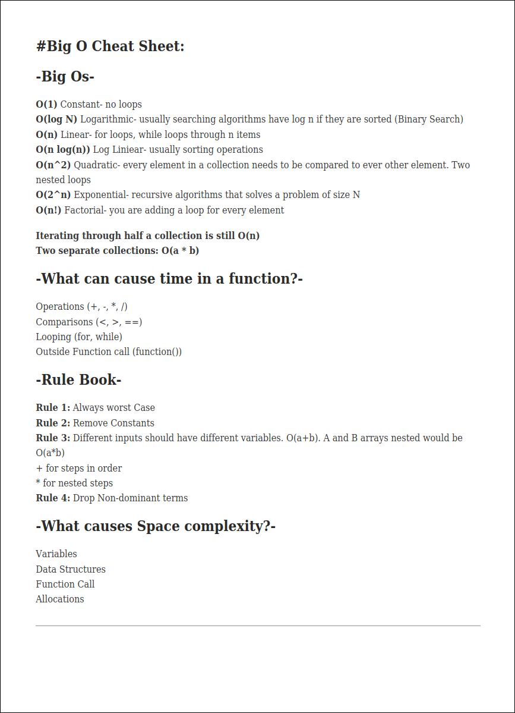

# Data Structures and Algorithms in Python

Welcome to my repository dedicated to learning and implementing core **Data Structures and Algorithms (DSA)** using Python.

This project is built as a study aid, interview preparation tool, and personal reference.

To check how the implementation works of each Data Structure, open a Custom(Structure).py to view the code.

---

## Big O Notation

Big O Notation is a way to describe the **performance** or **complexity** of an algorithm. It expresses how the runtime or space requirements of an algorithm grow relative to the input size. Big O helps us understand which algorithm is more efficient as inputs become large.

Common complexities include:

- **O(1)** – Constant time
- **O(log n)** – Logarithmic time
- **O(n)** – Linear time
- **O(n log n)** – Linearithmic time
- **O(n²)** – Quadratic time
- **O(2ⁿ)** – Exponential time

Below are visual resources to help illustrate this concept:




---

## Project Structure

- Each data structure or algorithm is organized in its own directory.
- Where applicable, example usage and test files are included.
- All illustrations are located in the `images/` folder.

---

## Arrays

Covers fundamental array operations:
- Insertion and deletion
- Searching and sorting
- Rotation and reversal

---

## Hash Tables

Includes implementations of:
- Hash Table with Separate Chaining
Covers operations like:
- Insertion and deletion
- Key lookup
- Collision handling

---

## Linked Lists

Includes implementations of:
- Singly Linked List
- Doubly Linked List

Covers operations like insertion, deletion, search, and reversal.

---

## Stacks & Queues

Stack and queue implementations using:
- Python lists
- Linked lists
- `collections.deque`
- Priority Queue using `heapq`

---

## Trees

Includes:
- Binary Trees
- Binary Search Trees (BST)
- Tree traversals: in-order, pre-order, post-order
- Self-balancing AVL Tree

---

## Graphs

Graph implementations using adjacency lists and matrices.

Algorithms:
- BFS and DFS
- Dijkstra’s Algorithm
- Kruskal and Prim (MST)

---

## Recursion

Examples:
- Tower of Hanoi
- Permutations and combinations
- N-Queens problem

---

## Sorting Algorithms

Includes:
- Bubble Sort
- Insertion Sort
- Merge Sort
- Quick Sort
- Heap Sort

---

## Searching Algorithms

Includes:
- Linear Search
- Binary Search (iterative & recursive)
- Interpolation Search

---


## Dynamic Programming

Solved problems:
- Fibonacci (Memoization & Tabulation)
- 0/1 Knapsack
- Longest Common Subsequence (LCS)

---

## Complexity Analysis

Each function includes analysis of time and space complexity.

---

## How to Run

```bash
git clone https://github.com/yxngalx/dsa.git
cd dsa
python3 some_file.py
```
